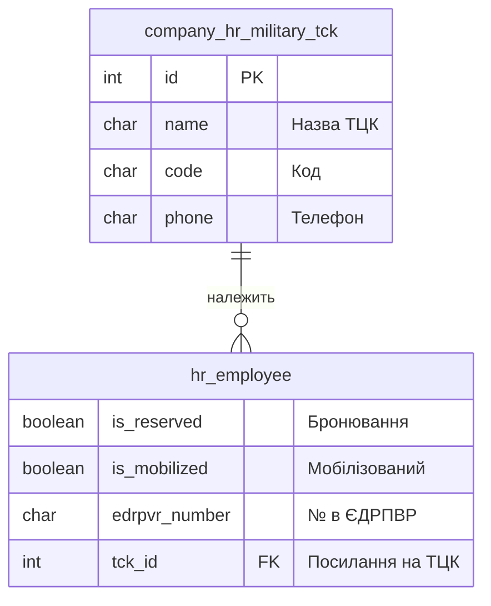
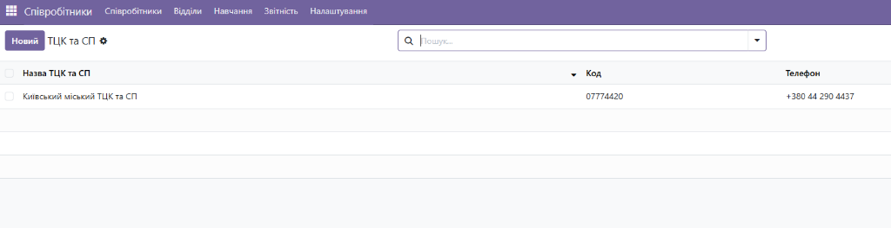
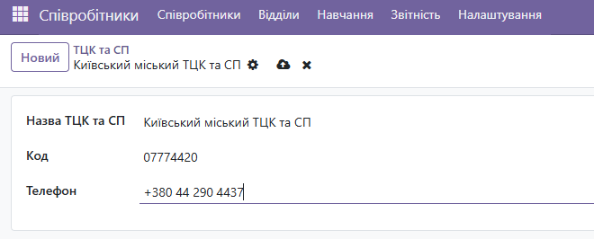
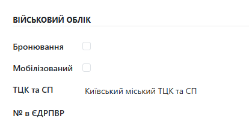

# company_hr_military — Модуль Odoo 19

> **Тестове завдання** на позицію Odoo Developer (Python) у компанії **ENAMINE**.
> Автор: **Dmytro Lutvunenko**

[](https://github.com/Lutvunenko-Dmutro/odoo-test-assignment/actions)
[](https://www.odoo.com/)
[](https://www.python.org/)
[](https://www.postgresql.org/)
[](https://ubuntu.com/)

---

🇺🇦 Українська &nbsp;|&nbsp; [🇬🇧 English](README.en.md)

---

## 📋 Опис

Кастомний модуль для Odoo 19 Community Edition, що розширює стандартний HR-модуль функціоналом військового обліку співробітників відповідно до вимог законодавства України.

### Що робить модуль

| Функціонал | Опис |
|---|---|
| **Довідник ТЦК та СП** | Нова модель (`company_hr_military.tck`) для зберігання даних про територіальні центри комплектування: назва, код, телефон |
| **Розширення картки співробітника** | Додає 4 нові поля до `hr.employee`: Бронювання, Мобілізований, ТЦК та СП (Many2one), № в ЄДРПВР |
| **Інтеграція в UI** | Нові поля відображаються в окремому блоці **"Військовий облік"** на вкладці **"Приватна інформація"** картки співробітника |
| **Пункт меню** | Додано "ТЦК та СП" у меню Співробітники → Налаштування |

### Схема бази даних (ER Diagram)



---

## 📸 Демонстрація функціоналу

### 1. Довідник ТЦК та СП



### 2. Картка співробітника (Військовий облік)


---

## 🗂️ Структура проекту

```
odoo-test-assignment/
├── .github/
│   └── workflows/
│       └── odoo-ci.yml             # GitHub Actions: flake8 лінтер (CI/CD)
├── company_hr_military/
│   ├── models/
│   │   ├── __init__.py
│   │   ├── tck.py                  # Модель довідника ТЦК та СП
│   │   └── hr_employee.py          # Розширення hr.employee (_inherit)
│   ├── security/
│   │   └── ir.model.access.csv     # Права доступу для всіх користувачів
│   ├── tests/
│   │   ├── __init__.py
│   │   └── test_hr_military.py     # Unit-тести (TransactionCase)
│   ├── views/
│   │   ├── tck_views.xml           # List & Form вигляди + меню для ТЦК
│   │   └── hr_employee_views.xml   # XPath-ін'єкція у форму співробітника
│   ├── __init__.py
│   └── __manifest__.py
├── .gitignore
├── odoo.conf                       # Приклад конфігураційного файлу
├── README.md                       # 🇺🇦 Ця документація
└── README.en.md                    # 🇬🇧 English documentation
```

---

## ⚙️ Налаштування оточення

**Стек:** Ubuntu 24.04 (WSL2 на Windows 11) · Python 3.12 · PostgreSQL 18 (нативно, без Docker) · Odoo 19.0 CE (з вихідного коду)

### Крок 1 — Системні залежності

```bash
sudo apt update && sudo apt upgrade -y
sudo apt install -y python3 python3-pip python3-venv python3-dev \
    build-essential libxml2-dev libxslt1-dev libldap2-dev libsasl2-dev \
    libtiff5-dev libjpeg8-dev libpq-dev libfreetype6-dev liblcms2-dev \
    libwebp-dev libharfbuzz-dev libfribidi-dev libxcb1-dev git
```

### Крок 2 — PostgreSQL (нативне встановлення, без Docker)

```bash
sudo apt install -y postgresql postgresql-client
sudo service postgresql start

# Створення користувача БД для Odoo
sudo su - postgres -c "createuser -s odoo"
sudo su - postgres -c "psql -c \"ALTER USER odoo WITH PASSWORD 'odoo';\""
```

> ⚠️ **WSL2:** Використовуйте `sudo service postgresql start` замість `systemctl` — systemd вимкнений у WSL2 за замовчуванням.

### Крок 3 — wkhtmltopdf (для генерації PDF-звітів)

```bash
wget https://github.com/wkhtmltopdf/packaging/releases/download/0.12.6.1-2/wkhtmltox_0.12.6.1-2.jammy_amd64.deb
sudo apt install -y ./wkhtmltox_0.12.6.1-2.jammy_amd64.deb
```

### Крок 4 — Клонування вихідного коду Odoo 19

```bash
# Клонуємо в домашню директорію Linux (НЕ в /mnt/d/ — git chmod не працює на NTFS)
mkdir ~/odoo && cd ~/odoo
git clone --branch 19.0 --single-branch --depth 1 https://github.com/odoo/odoo.git .
```

> ⚠️ **Важливо:** Завжди клонуйте Odoo у нативну Linux-файлову систему (`~/`), а не на змонтований Windows-диск (`/mnt/d/`). Операція `git chmod` на NTFS завершується помилкою.

### Крок 5 — Віртуальне Python-середовище

```bash
python3 -m venv ~/odoo-venv
source ~/odoo-venv/bin/activate

pip install setuptools wheel
pip install -r ~/odoo/requirements.txt
```

### Крок 6 — Клонування цього репозиторію та конфігурація

```bash
git clone https://github.com/Lutvunenko-Dmutro/odoo-test-assignment.git ~/odoo-test-assignment
```

Відредагуйте `odoo.conf`, вказавши правильний `addons_path`:

```ini
[options]
admin_passwd = admin_master_password
db_host = localhost
db_port = 5432
db_user = odoo
db_password = odoo
addons_path = ~/odoo/addons,~/odoo-test-assignment
http_port = 8069
```

> ⚠️ **WSL2:** Обов'язково встановіть `db_host = localhost`. Без цього PostgreSQL використовує peer-автентифікацію, яка не працює для не-`postgres` системних користувачів.

### Крок 7 — Запуск сервера

```bash
source ~/odoo-venv/bin/activate
cd ~/odoo
./odoo-bin -c ~/odoo-test-assignment/odoo.conf
```

Відкрийте `http://localhost:8069` у браузері.

---

## 🚀 Встановлення модуля

1. Створіть нову базу даних на `http://localhost:8069` (увімкніть **Demo data** для тестових даних).
2. Перейдіть у **Налаштування** → прокрутіть вниз → натисніть **Активувати режим розробника**.
3. Перейдіть у **Додатки** → натисніть **Оновити список додатків** → підтвердіть.
4. Знайдіть `Military` → оберіть **Company HR Military** → натисніть **Активувати**.

---

## 🧪 Запуск тестів

```bash
source ~/odoo-venv/bin/activate
cd ~/odoo
./odoo-bin -c ~/odoo-test-assignment/odoo.conf \
    --test-enable \
    --stop-after-init \
    -u company_hr_military \
    -d test_db
```

Тестовий набір перевіряє:
- ✅ Створення запису ТЦК та збереження полів
- ✅ Збереження військових полів у картці співробітника
- ✅ Зв'язок Many2one між співробітником та ТЦК

---

## 🔄 CI/CD

Кожен push у гілку `main` автоматично запускає **GitHub Actions** (`.github/workflows/odoo-ci.yml`):
1. Розгортає Ubuntu в хмарі GitHub.
2. Встановлює Python 3.10 + `flake8`.
3. Запускає два проходи лінтера на `company_hr_military/`:
   - **Прохід 1:** Жорстка зупинка при синтаксичних помилках (`E9`, `F63`, `F7`, `F82`)
   - **Прохід 2:** Перевірка стилю PEP8 (попередження, макс. довжина рядка 120)

---

## 🐛 Виклики та вирішення

| Проблема | Рішення |
|---|---|
| `git chmod` падає на `/mnt/d/` (NTFS) | Клонував Odoo у нативну Linux-директорію `~/` |
| `python3 -m venv` падає на `/mnt/d/` | Створив venv у `~/odoo-venv` на Linux-файловій системі |
| Помилка peer-автентифікації PostgreSQL | Встановив `db_host = localhost` у `odoo.conf` для TCP-з'єднання |
| `odoo.conf` попереджає `db_host reads 'False'` | Замінив плейсхолдер `False` на реальне значення `localhost` |
| Odoo 19 не приймає тег `<tree>` у XML-в'юхах | Замінив на `<list>` — перейменовано в Odoo 19 (breaking change з версії 18) |

---

## 📦 Технічний стек

- **Odoo 19.0 CE** (Community Edition, з вихідного коду)
- **Python 3.12**
- **PostgreSQL 18** (нативно, без Docker)
- **Ubuntu 24.04** через WSL2
- **GitHub Actions** для CI/CD (flake8 лінтер)
